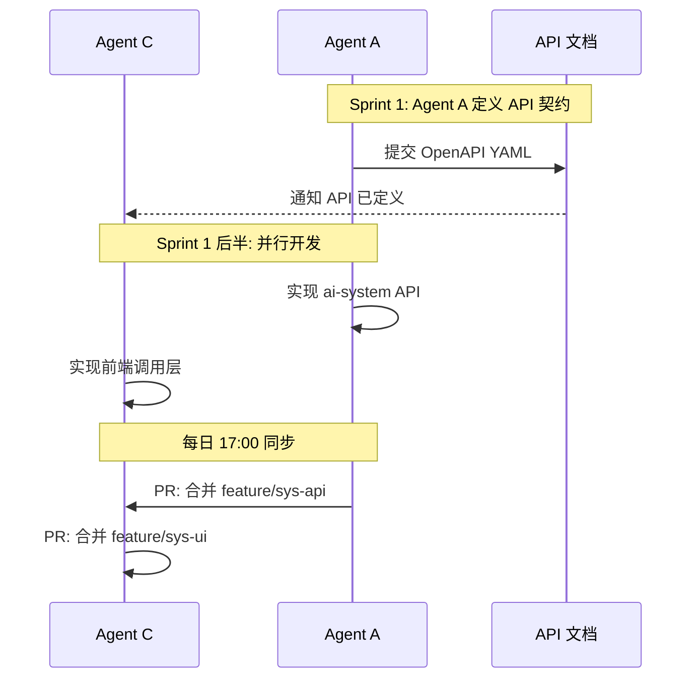

# Agent 工作流手册 (AGENT-WORKFLOW)

> **目的**:详细定义 AI-Platform 项目开发中**多 Agent 协作**的执行模式、规则和工具。
> **决策日期**: 2026-06-08
> **适用**: 所有参与项目开发的 Agent 和人类开发者

---

## 目录

1. [概述](#1-概述)
2. [执行模式选择](#2-执行模式选择)
3. [混合模式详细设计](#3-混合模式详细设计)
4. [Agent 角色与分工](#4-agent-角色与分工)
5. [模块边界与权限](#5-模块边界与权限)
6. [API 契约先行](#6-api-契约先行)
7. [并行开发规则](#7-并行开发规则)
8. [共享文件管理](#8-共享文件管理)
9. [每日协调机制](#9-每日协调机制)
10. [工具配置](#10-工具配置)
11. [CI/CD 集成](#11-cicd-集成)
12. [风险与异常处理](#12-风险与异常处理)
13. [附录](#13-附录)

---

## 1. 概述

### 1.1 为什么需要 Agent 工作流

AI-Platform 项目有:
- **6 人团队**(后端3 + 前端2 + 测试0.5)
- **8 周工期**(4 个 Sprint)
- **37 张数据库表**
- **22 个核心 UI 界面**
- **12 个 AI 节点**
- **5 种触发器**
- **多模块并行开发需求**

如用单 Agent 串行,8 周无法完成。如用全并行,易冲突。采用**混合模式**。

### 1.2 核心原则

```
✅ 原则 1:基础先行(必须串行)
   公共依赖、配置、API 契约必须先定

✅ 原则 2:模块自治(并行友好)
   每个 Agent 拥有独立模块的完全所有权

✅ 原则 3:边界清晰(避免冲突)
   通过文件路径范围和代码 Owner 机制

✅ 原则 4:契约优先(异步兼容)
   跨模块接口先定 OpenAPI,再并行实现

✅ 原则 5:集成兜底(必串行)
   联调、压测、上线必须串行
```

---

## 2. 执行模式选择

### 2.1 三种模式对比

| 维度 | 单 Agent 串行 | 全并行 | **混合模式(本项目)** |
|---|---|---|---|
| 速度 | ⭐ | ⭐⭐⭐ | ⭐⭐ |
| 协调成本 | ⭐ | ⭐⭐⭐ | ⭐⭐ |
| 代码冲突 | ⭐ | ⭐⭐⭐ | ⭐ |
| 上下文一致性 | ⭐⭐⭐ | ⭐ | ⭐⭐ |
| 适合场景 | 单人 / 小项目 | 完全独立任务 | **有依赖的复杂项目** |

### 2.2 决策记录

| 选项 | 评估 | 决定 |
|---|---|---|
| 单 Agent 串行 | 工期翻倍,不接受 | ❌ |
| 全并行 | 公共模块冲突多,API 难对齐 | ❌ |
| 混合模式 | 平衡速度和质量 | ✅ |

---

## 3. 混合模式详细设计

### 3.1 整体节奏

```
Week 0      Week 1-2       Week 3-4       Week 5-6       Week 7-8
   │            │              │              │              │
   ▼            ▼              ▼              ▼              ▼
┌──────┐    ┌──────┐      ┌──────┐      ┌──────┐      ┌──────┐
│ 单   │    │ 并   │      │ 并   │      │ 并   │      │ 单   │
│ Agent│    │ 行 3 │      │ 行 3 │      │ 行 3 │      │ Agent│
└──────┘    └──────┘      └──────┘      └──────┘      └──────┘
  预研       系统管理+项目   AI+知识库+对话  流程+助手+触发  集成+部署
   1 周         2 周           2 周           2 周           2 周
```

### 3.2 阶段详情

#### 阶段 1:基础搭建(Sprint 0-1 前半)

**Agent 数:1**
**任务**:Sprint 0 + Sprint 1 第一周

```
1. 后端工程脚手架 (Spring Boot 3.5 多模块)
2. 公共模块 (ai-common)
3. 基础框架 (ai-framework: Shiro + JWT + Caffeine)
4. 数据库初始化脚本
5. 前端工程脚手架 (Vue3 + Vite + Element Plus)
6. 登录页 + 主布局
```

**为什么串行**:这些都是后续所有模块的依赖,必须先就位。

#### 阶段 2:模块并行(Sprint 1 后半 + Sprint 2-3)

**Agent 数:3**
**任务**:按模块边界并行

| Agent | 负责模块 |
|---|---|
| Agent A(后端A) | 系统管理 + 项目域 |
| Agent B(后端B) | AI 业务 + 流程引擎 |
| Agent C(架构师 + 前端) | 助手 + 流程编辑器 + 触发器 |

详见 [§4 Agent 角色与分工](#4-agent-角色与分工)

**为什么并行**:模块边界清晰,API 契约已定,各 Agent 可独立推进。

#### 阶段 3:联调上线(Sprint 4)

**Agent 数:1-2**
**任务**:集成、压测、修复、部署

```
1. 前后端联调
2. 性能压测
3. Bug 修复
4. 用户手册
5. 部署上线
```

**为什么串行**:联调需要紧密协作,串行避免沟通混乱。

---

## 4. Agent 角色与分工

### 4.1 三个并行 Agent

#### Agent A:系统域负责人

| 维度 | 内容 |
|---|---|
| **负责模块** | 系统管理 + 项目域 |
| **后端路径** | `ai-system/`、`ai-project/` |
| **前端路径** | `views/system/`、`views/project/` |
| **数据库表** | 10 张 sys_* + 6 张 ai_project* |
| **核心能力** | Shiro 鉴权、用户/角色/菜单/部门、RBAC、项目 CRUD、API Key、Webhook |
| **可拥有文件** | 上述路径下所有文件 |
| **不可修改** | `ai-flow/`、`ai-ai/`、`ai-framework/`、`ai-common/` |

#### Agent B:AI 域负责人

| 维度 | 内容 |
|---|---|
| **负责模块** | AI 业务 + 流程引擎 |
| **后端路径** | `ai-ai/`、`ai-flow/` |
| **前端路径** | `views/knowledge/`、`views/prompt/`、`views/model/`、`views/mcp/` |
| **数据库表** | ai_model、ai_mcp、ai_knowledge*、ai_prompt*、ai_flow* |
| **核心能力** | LangChain4j 集成、Hnswlib、LiteFlow、12 节点、5 触发器 |
| **可拥有文件** | 上述路径下所有文件 |
| **不可修改** | `ai-system/`、`ai-project/`、`ai-framework/` |

#### Agent C:前端主程 + 架构师(混合角色)

| 维度 | 内容 |
|---|---|
| **负责模块** | 流程编辑器 + 助手 + 公共前端框架 |
| **后端路径** | `ai-assistant/`、`ai-start/` |
| **前端路径** | `views/flow/editor/`、`views/assistant/`、`layouts/`、`router/` |
| **数据库表** | ai_assistant*、ai_chat* |
| **核心能力** | LogicFlow、Element Plus 封装、AI 对话 SSE、助手工具调用 |
| **可拥有文件** | 上述路径 + 公共前端配置 |
| **不可修改** | `ai-system/`、`ai-flow/nodes/`(具体实现) |

### 4.2 跨 Agent 协作

当需要跨 Agent 边界时(如 Agent A 的 API 需被 Agent C 调用):



---

## 5. 模块边界与权限

### 5.1 配置文件

```json
// .claude/agents/system-agent.json
{
  "name": "system-agent",
  "scope": [
    "ai-system/**",
    "ai-project/**",
    "views/system/**",
    "views/project/**",
    "docs/system/**"
  ],
  "exclusive": true,
  "rules": [
    "不修改 ai-flow/、ai-ai/、ai-assistant/ 代码",
    "不修改 ai-framework/、ai-common/ 公共模块",
    "公共配置文件修改需先在群组声明"
  ]
}
```

```json
// .claude/agents/ai-agent.json
{
  "name": "ai-agent",
  "scope": [
    "ai-ai/**",
    "ai-flow/**",
    "views/knowledge/**",
    "views/prompt/**",
    "views/model/**",
    "views/mcp/**"
  ],
  "exclusive": true,
  "rules": [
    "不修改 ai-system/、ai-project/ 代码",
    "不修改 views/flow/editor/ 流程编辑器(由 frontend-agent 负责)"
  ]
}
```

```json
// .claude/agents/frontend-agent.json
{
  "name": "frontend-agent",
  "scope": [
    "ai-assistant/**",
    "views/flow/editor/**",
    "views/assistant/**",
    "layouts/**",
    "router/**",
    "store/**",
    "components/**"
  ],
  "exclusive": true,
  "rules": [
    "不修改 ai-system/、ai-project/、ai-flow/、ai-ai/ 业务代码",
    "公共组件可跨模块使用,但需声明"
  ]
}
```

### 5.2 边界检查工具

```bash
# .claude/hooks/check-scope.sh
#!/bin/bash
# 在 git commit 前检查 Agent 是否越界

AGENT_TYPE=$(cat .claude/agent-type 2>/dev/null || echo "unknown")
if [ "$AGENT_TYPE" = "unknown" ]; then
  exit 0
fi

# 读取 Agent scope 配置
SCOPE=$(jq -r '.scope[]' ".claude/agents/${AGENT_TYPE}.json")

# 检查暂存文件是否在 scope 内
git diff --cached --name-only | while read file; do
  in_scope=false
  for s in $SCOPE; do
    if [[ "$file" == $s ]]; then
      in_scope=true
      break
    fi
  done
  if [ "$in_scope" = false ]; then
    echo "❌ Agent $AGENT_TYPE 越界修改: $file"
    exit 1
  fi
done
```

---

## 6. API 契约先行

### 6.1 为什么需要

并行开发的致命问题:**接口不对齐**。Agent A 的 API 与 Agent C 的调用不匹配。

**解决**:并行开始前,先冻结所有跨模块接口。

### 6.2 契约规范

#### 文件位置

```
docs/api/
├── ai-system.yaml    # 系统管理 API
├── ai-project.yaml   # 项目域 API
├── ai-flow.yaml      # 流程引擎 API
├── ai-knowledge.yaml # 知识库 API
├── ai-assistant.yaml # 助手 API
└── common.yaml       # 公共定义(分页、响应、错误码)
```

#### 契约模板(OpenAPI 3.0)

```yaml
openapi: 3.0.3
info:
  title: AI Flow API
  version: 1.0.0
  description: 流程引擎相关接口

paths:
  /api/v1/ai/flow/{id}/run:
    post:
      summary: 运行流程
      tags: [Flow]
      security:
        - bearerAuth: []
      parameters:
        - name: id
          in: path
          required: true
          schema: { type: integer, format: int64 }
      requestBody:
        required: true
        content:
          application/json:
            schema:
              $ref: '#/components/schemas/RunFlowRequest'
      responses:
        200:
          description: 成功
          content:
            application/json:
              schema:
                $ref: '#/components/schemas/ResultRunFlowResponse'
        400:
          $ref: '#/components/responses/BadRequest'
        401:
          $ref: '#/components/responses/Unauthorized'

components:
  schemas:
    RunFlowRequest:
      type: object
      required: [input]
      properties:
        input:
          type: object
          additionalProperties: true
        async:
          type: boolean
          default: false
    ResultRunFlowResponse:
      type: object
      properties:
        code: { type: integer, example: 200 }
        message: { type: string }
        result:
          $ref: '#/components/schemas/FlowRunResult'
```

### 6.3 契约变更流程

当需要变更已冻结的 API:

```
1. 在群组发布变更通知
   "【API 变更】/api/v1/ai/flow/run 新增 async 字段,影响 Agent C"
2. 等待所有依赖方确认(24h)
3. 更新 OpenAPI YAML
4. 提交 API 变更 PR(标记 API-CHANGE)
5. 自动触发依赖方的 PR 通知
```

### 6.4 契约验证

CI 中加入:

```yaml
# .github/workflows/api-contract.yml
name: API Contract Check
on: [push, pull_request]
jobs:
  validate:
    runs-on: ubuntu-latest
    steps:
      - uses: actions/checkout@v4
      - name: Validate OpenAPI
        run: npx @redocly/cli lint docs/api/
      - name: Check backward compatibility
        run: npx oasdiff diff base:head docs/api/ --fail-on-incompatible
```

---

## 7. 并行开发规则

### 7.1 黄金法则

```
1. 一个文件,一个 Agent(同一时间)
2. 一个接口,先契约后实现
3. 一次合并,解决所有冲突
4. 一天一次,merge 到 develop
```

### 7.2 日常节奏

```
09:00  Agent 启动,checkout develop, pull
09:30  站会(15 min,简报昨日 + 今日)
10:00 开始编码(独立模块内)
12:00 午休
13:00 继续编码
15:00 提交本地 commit(feature 分支)
17:00 推送到 GitHub + 通知团队
17:30 处理 review 反馈
18:00 收工
```

### 7.3 分支策略

```
main (生产) ←← PR (Squash merge)
  ↑
  PR (Squash merge)
  │
develop (开发集成)
  ↑
  PR (Code review 必需)
  │
feature/AI-XXX-xxx
fix/AI-XXX-xxx
hotfix/AI-XXX-xxx
```

### 7.4 提交信息规范

遵循 Conventional Commits:

```bash
# 格式
<type>(<scope>): <subject>

<body>

<footer>

# 示例
feat(flow): add LLM node implementation

- Add LangChain4j integration
- Support multi-provider config
- Add token usage tracking

Refs: AI-101
```

详细规范见 [`docs/GIT-WORKFLOW.md`](GIT-WORKFLOW.md)

---

## 8. 共享文件管理

### 8.1 共享文件清单

以下文件被多个模块依赖,**修改需声明**:

| 文件 | 谁可改 | 协调方式 |
|---|---|---|
| `pom.xml` | 后端架构师 | 群组声明,2h 内无异议 |
| `ai-common/` | 后端架构师 | 群组声明 |
| `ai-framework/` | 后端架构师 | 群组声明 |
| `vite.config.ts` | 前端主程 | 群组声明 |
| `package.json` | 前端主程 | 群组声明 |
| `application.yml` | 后端架构师 | 群组声明 |
| `router/index.ts` | 前端主程 | 群组声明 |
| `layouts/` | 前端主程 | 群组声明 |
| `store/` | 前端主程 | 群组声明 |
| `types/api.d.ts` | 各自模块 | PR 注明 |

### 8.2 声明模板

```
【共享文件修改】
文件: ai-common/src/main/java/.../Result.java
修改人: @zhangsan
原因: 增加 code 字段以支持新的错误码
影响: 所有 API 响应(向后兼容)
请在 2h 内反馈,无异议将合并。
PR: https://github.com/.../pull/123
```

### 8.3 冲突解决优先级

```
1. 架构师 (后端/前端) > 模块负责人
2. 后修改的 > 先修改的(在合理范围内)
3. 通过 PR 评论 + 团队会议解决分歧
```

---

## 9. 每日协调机制

### 9.1 站会(每日 9:30,15 min)

**议程**:
```
1. 昨日完成 [1 min/人]
2. 今日计划 [1 min/人]
3. 阻塞项讨论 [3-5 min]
```

**模板**(由 Agent 自动生成):

```markdown
## 站会 - 2026-06-09 (Day 5)

### @agent-a
- 昨日: 完成 sys_user/role CRUD
- 今日: 实现 sys_menu 树形结构
- 阻塞: 无

### @agent-b
- 昨日: LangChain4j 集成 80%
- 今日: 多厂商适配 + 单测
- 阻塞: 等待 Hnswlib 集成方案确认

### @agent-c
- 昨日: 登录页 + 主布局
- 今日: 系统管理页面 UI
- 阻塞: 无
```

### 9.2 每日 Merge 流程

```
17:00  各自 push feature/fix 分支
17:30  在 GitHub 发起 PR
       ↓
       (CI 自动运行)
       ↓
18:00  Code Review
       ├─ ✅ 通过 → Squash merge 到 develop
       └─ ❌ 修改 → 反馈后再次提交
```

### 9.3 周会(每周一 10:00,1h)

**议程**:
```
1. 上周 Sprint 完成情况 [20 min]
   - 完成率
   - 关键指标(用户故事/缺陷/QPS)
2. 演示 [20 min]
   - 每个 Agent Demo 关键功能
3. 风险/阻塞 [10 min]
4. 本周计划 [10 min]
```

---

## 10. 工具配置

### 10.1 Claude Code Agent 配置

#### 项目根 `.claude/CLAUDE.md`(自动加载)

(已存在,本文件)

#### `.claude/agent-type`

记录当前 Agent 类型:

```bash
# 后端架构师
echo "system-architect" > .claude/agent-type

# Agent A
echo "system-agent" > .claude/agent-type

# Agent B
echo "ai-agent" > .claude/agent-type

# Agent C
echo "frontend-agent" > .claude/agent-type
```

#### `.claude/settings.json`

```json
{
  "permissions": {
    "edit": {
      "allow": ["**/*.java", "**/*.vue", "**/*.ts", "**/*.md", "**/*.yml"],
      "deny": [".env", "**/secrets/**"]
    },
    "bash": {
      "allow": ["mvn", "npm", "git", "java", "node"],
      "deny": ["rm -rf", "sudo", "chmod 777"]
    }
  }
}
```

### 10.2 Cursor / Windsurf / 其他工具

如使用 IDE 集成工具,配置类似:

```json
// .cursorrules 或 .windsurfrules
{
  "agent_type": "system-agent",
  "scope": ["ai-system/**", "ai-project/**"],
  "language": "zh-CN",
  "auto_load": [".memory/CLAUDE.md", "docs/SOW.md", "docs/PLAN.md"]
}
```

### 10.3 Git Hooks

#### `commit-msg` hook

验证 Conventional Commits:

```bash
#!/bin/sh
# .git/hooks/commit-msg

commit_msg=$(cat $1)
if ! echo "$commit_msg" | grep -qE "^(feat|fix|docs|style|refactor|perf|test|chore|build|ci|revert)(\(.+\))?: .{1,100}$"; then
  echo "❌ Commit message does not follow Conventional Commits"
  echo "Format: <type>(<scope>): <subject>"
  exit 1
fi
```

#### `pre-commit` hook

Agent 边界检查 + 格式化:

```bash
#!/bin/sh
# .git/hooks/pre-commit

# 1. Agent 边界检查
if [ -f .claude/agent-type ]; then
  AGENT_TYPE=$(cat .claude/agent-type)
  if [ -f ".claude/agents/${AGENT_TYPE}.json" ]; then
    echo "🔍 Checking agent scope for ${AGENT_TYPE}..."
    # ... 范围检查逻辑
  fi
fi

# 2. 格式化
mvn -B -q com.diffplug.spotless:spotless-maven-plugin:apply 2>/dev/null || true
npx prettier --write "**/*.{ts,vue,scss}" 2>/dev/null || true

# 3. 添加格式化的变更
git add -u
```

---

## 11. CI/CD 集成

### 11.1 PR 级别检查

每次 PR 触发:

```yaml
# .github/workflows/pr-check.yml (已存在)
1. Agent 边界检查
   - 验证文件路径在 Agent scope 内
2. Conventional Commits 检查
3. ESLint/Checkstyle
4. TypeScript 编译
5. 单元测试
6. API 契约兼容性 (oasdiff)
7. CodeQL 安全扫描
```

### 11.2 develop 分支检查

```yaml
# .github/workflows/develop.yml
on:
  push:
    branches: [develop]

jobs:
  integration-test:
    services:
      mariadb:
        image: mariadb:12.2
    steps:
      - run: mvn -B verify
      - run: npm run build
      - run: npm run test:integration
```

### 11.3 main 分支检查

```yaml
# .github/workflows/main.yml
on:
  push:
    branches: [main]

jobs:
  full-test:
    steps:
      - run: mvn -B verify -Pfull-test
      - run: npm run build
      - run: npm run test:e2e
      - run: docker build (验证)
```

### 11.4 部署触发

| 事件 | 部署目标 | 工作流 |
|---|---|---|
| push to develop | staging | cd.yml (auto) |
| push to main | production | cd.yml (manual) |
| tag v*.*.* | production | cd.yml (manual) |
| workflow_dispatch | staging / production | cd.yml (manual) |

---

## 12. 风险与异常处理

### 12.1 风险矩阵

| 风险 | 等级 | 应对 |
|---|---|---|
| 并行 Agent 改同一文件 | 中 | 严格模块边界 + 共享文件声明 |
| API 契约频繁变更 | 中 | 契约冻结期 + 变更通知 |
| 上下文不一致 | 中 | 每日 merge develop |
| 测试覆盖不足 | 中 | PR 卡门禁 |
| Agent 性能差异 | 低 | 任务大小均衡分配 |
| 跨时区协作 | 低 | 异步沟通 + 文档化 |
| Sprint 进度落后 | 高 | 启动 buffer 机制 |

### 12.2 异常处理

#### 文件冲突

```bash
# Agent A 推了一个 PR
# Agent C 同时推了 PR 改同一文件

# 解决:立即在群组报告
# Agent A 决定:
#   - 重命名自己的文件
#   - 或者 PR 评论协调
#   - 或者 @架构师 仲裁
```

#### API 契约冲突

```
# 场景:Agent A 修改了 API 但未通知 Agent C
# 后果:Agent C 的前端调用失败

# 应对:
1. Agent C 提 Issue 报告
2. Agent A 立即修复或回滚
3. 后续 PR 增加 API 变更标签
4. CI 加入 oasdiff 兼容性检查
```

#### 进度严重落后

```
触发条件: Sprint 中期 review,完成率 < 60%

应对:
1. 全团队会议
2. 砍掉 P1/P2 功能
3. 增加 buffer
4. 重新分配任务
```

### 12.3 应急联系

| 场景 | 联系 |
|---|---|
| 阻塞超过 2h | 群组 @ 架构师 |
| 文件冲突 | PR 评论 + @ 对方 Agent |
| 紧急 Bug | 群组 + 电话 |
| Sprint 风险 | 周会讨论 + 升级 |

---

## 13. 附录

### 13.1 模块所有权矩阵

| 模块 | Owner Agent | 后端 Owner | 前端 Owner |
|---|---|---|---|
| 系统管理 | Agent A | 后端 A | 前端开发 |
| 项目域 | Agent A | 后端 A | 前端开发 |
| AI 模型 | Agent B | 后端 B | 前端开发 |
| MCP 服务 | Agent B | 后端 B | 前端开发 |
| 知识库 | Agent B | 后端 B | 前端开发 |
| 提示词 | Agent B | 后端 B | 前端开发 |
| 流程引擎 | Agent B | 后端 B | Agent C |
| 流程编辑器 | Agent C | - | Agent C |
| AI 助手 | Agent C | 架构师 | Agent C |
| AI 对话 | Agent C | 架构师 | Agent C |
| 系统监控 | Agent A | 后端 A | Agent C |
| 公共框架 | 架构师 | 架构师 | Agent C |

### 13.2 Agent 启动检查清单

启动 Agent 前确认:

- [ ] `.claude/agent-type` 已设置
- [ ] `.claude/agents/{type}.json` 已配置
- [ ] 当前分支是 develop 或 feature/*
- [ ] 已 `git pull`
- [ ] 已知本 Sprint 任务
- [ ] 已读取 `.memory/CLAUDE.md`
- [ ] 已知当日 API 变更

### 13.3 常见命令速查

```bash
# Agent 类型设置
echo "system-agent" > .claude/agent-type

# 切换到正确分支
git checkout develop && git pull

# 创建功能分支
git checkout -b feature/AI-XXX-description

# 提交(规范信息)
git add .
git commit -m "feat(scope): description"

# 推送并创建 PR
git push -u origin feature/AI-XXX-description

# 查看 Agent 边界
cat .claude/agents/$(cat .claude/agent-type).json

# 查看共享文件
cat docs/OPERATIONS.md | grep -A 20 "共享文件"

# 触发 CI 检查
gh pr create --fill

# 查看 CI 状态
gh pr checks

# 合并到 develop
gh pr merge --squash --delete-branch
```

### 13.4 推荐 Agent 工具栈

| 工具 | 用途 | 备注 |
|---|---|---|
| **Claude Code** | Agent 主力 | 本项目主推 |
| **Cursor** | IDE 集成 | 可选 |
| **Aider** | 轻量级 CLI | 备选 |
| **GitHub CLI** | PR 管理 | 必装 |
| **Slack/飞书** | 群组协作 | 必装 |

### 13.5 关键时间点

| 日期 | 事件 |
|---|---|
| 2026-06-08 | 决策采用混合模式 |
| 2026-06-08 | Sprint 0 启动前 |
| TBD | Sprint 1 启动(并行起点) |

---

**AGENT-WORKFLOW 终**
